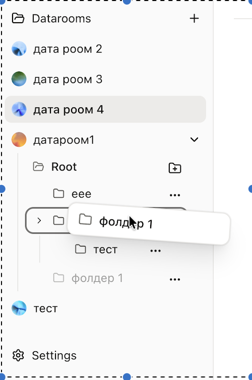
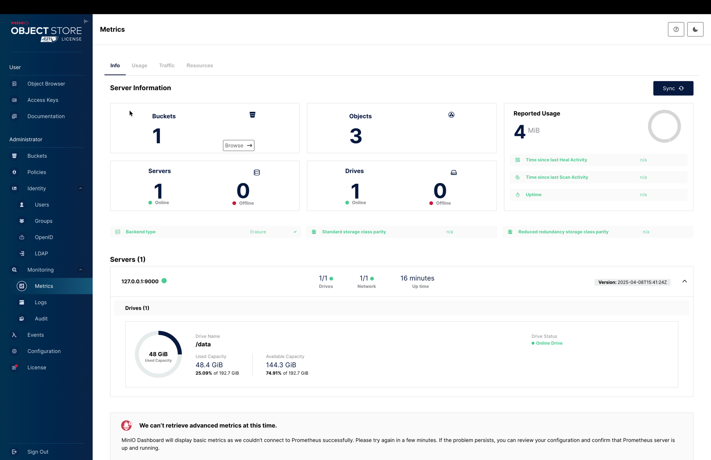
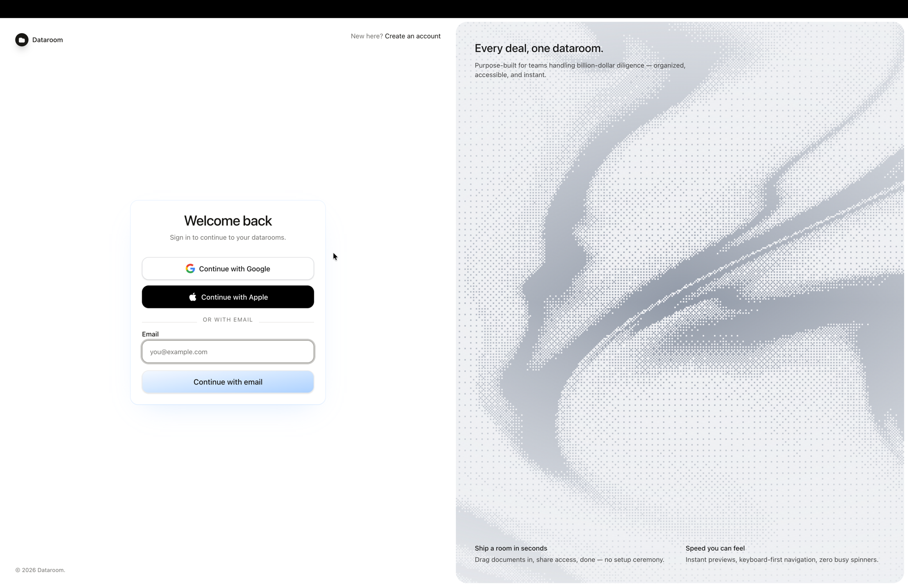
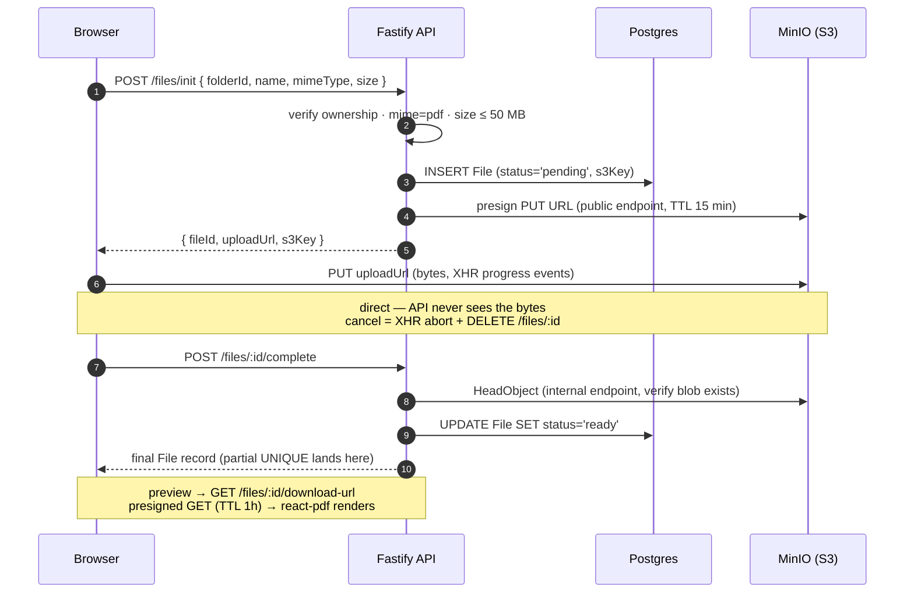

# Dataroom

A Google Drive–style virtual data room for M&A due diligence. Create datarooms, organize PDFs in nested folders, drag files anywhere, preview in the browser — no waiting on spinners.

Take-home coding challenge for Acme Corp.

## Live

| | URL |
|---|---|
| Web (Vercel) | **https://web-psi-ten-28.vercel.app/** |
| API (Dokploy) | https://api.dataroom.holy-water.app — `/health` → 200 |
| MinIO S3 + Console | https://minio.dataroom.holy-water.app |

Sign in with Google, Apple, or a magic-link email — no account needed to explore.

---

## What's inside

### Datarooms + nested folders with drag-and-drop

The whole navigation lives in one persistent sidebar. Every dataroom expands into a folder tree — grab any folder or file and drop it into another folder, another dataroom, or the root. The drag preview follows the cursor, the drop target lights up, and the move is optimistic (mistake? undo it from the toast).



- Create / rename / soft-delete on datarooms, folders, files
- 5-second **Undo** on every delete (toast) + a full **Trash** view with Restore / Delete permanently
- Cascade soft-delete for folders (all descendants restored on undo, atomically)
- 409 name collisions surface a Replace / Keep both / Cancel modal
- Prefetch on hover, `keepPreviousData` on navigation, skeletons instead of spinners

### Direct-to-S3 uploads (MinIO)

PDF bytes never touch the API. The browser gets a presigned PUT URL, streams straight into MinIO with real XHR progress, then calls `/files/:id/complete`. Same S3 protocol locally, on the VPS, and if we ever swap MinIO for R2 or S3 (env-var change, no code).



- 50 MB / PDF-only enforced at the API before presigning
- Two `S3Client` instances — one internal (`http://minio:9000`, Docker network), one public (baked into the presigned URL)
- Deterministic `s3Key = {ownerId}/{dataroomId}/{fileId}.pdf` — no path traversal, no name collisions on disk
- Partial unique index on `(folderId, name) WHERE status='ready'` — a failed upload never blocks a retry
- In-browser preview via `react-pdf` (pdf.js) reading the same presigned GET URL

### Clerk auth — zero custom auth code

Sign-in and sign-up are Clerk-hosted. Google, Apple, and email magic-link work out of the box, so a reviewer can jump in without a pre-shared account. Every API call carries a fresh JWT (60 s TTL, never cached), and every mutating route checks ownership server-side.



- `@clerk/react@^6` (Core 3) on the front end — `<Show when="...">`, no legacy `<SignedIn>`
- `@clerk/backend@^3` verifies the JWT on Fastify preHandler
- No password reset, no email verification screen to build — Clerk owns the flow

---

## Stack — why each pick

| Layer | Choice | Why this and not the obvious alternative |
|---|---|---|
| Framework | **Vite + React 19 SPA** | Everything sits behind auth → SEO is irrelevant → Next.js SSR is dead weight. Vite gives instant HMR and a static `dist/` Vercel serves from the edge. |
| Router | **TanStack Router** | Type-safe params (`Route.useParams()` is fully inferred) and native React Query integration for prefetching. |
| Data | **TanStack Query** | Optimistic updates with the 5-step `cancel → snapshot → set → rollback → invalidate` template. Server state lives here; nothing else touches it. |
| Client state | **Zustand** | Only UI: selection, sidebar collapse, drag session. Never server data. Two stores, one rule. |
| UI | **Tailwind 4 + shadcn/ui** | 46 primitives copy-pasted in, fully owned. No component-library lock-in. |
| Drag-and-drop | **@dnd-kit** | The one DnD library that plays nicely with keyboard nav + screen readers. |
| PDF viewer | **react-pdf (pdf.js)** | Renders from a presigned URL, no proxying, no download-then-render. |
| Forms | **react-hook-form + Zod 4** | Same Zod schemas the backend validates against — one source of truth. |
| Auth | **Clerk** | Sign-in, magic links, OAuth providers, session management — solved. Focus goes to the actual product. |
| Backend | **Fastify 5** | Native Zod type provider (`fastify-type-provider-zod@7`) makes request + response validation typed end-to-end. |
| ORM | **Drizzle + postgres-js** | Zero-magic SQL, typed queries, migrations that read like SQL. Partial unique indexes are one line. |
| DB | **Postgres 16** | Partial unique indexes power the soft-delete + pending-upload semantics without hacky nullable columns. |
| Files | **MinIO (S3 API)** | Runs in the same compose as the API; swap to R2/S3 later with an env-var change. |
| Deploy | **Vercel (web) + Dokploy (api + db + minio)** | Static SPA to the edge, stateful services to a single VPS with Traefik + LE. |
| Monorepo | **pnpm + Turborepo + Biome** | One `pnpm dev` boots both apps; Biome replaces ESLint + Prettier with one config. |
| Shared code | **`packages/shared`** | Zod DTOs + typed error codes (`FOLDER_NAME_TAKEN`, `UPLOAD_INCOMPLETE`, …) imported by both apps. |

---

## Architecture

**Frontend** — Feature-Sliced Design (`app → pages → widgets → features → entities → shared`). Every feature has a hook that owns the mutation and a view that just renders. React Query calls never live inside a JSX-rendering component.

**Backend** — Fastify plugin → route → service → `db/queries`. Every mutation goes through a Clerk JWT check + ownership guard. Bytes never touch the API; presigned URLs do.

**Data model** — soft-delete via `deletedAt` on every entity, partial unique indexes so name reuse works after delete/failed-upload, FK cascade to backstop hard-delete from Trash.

Full spec in [`CLAUDE.md`](./CLAUDE.md) · Task brief in [`TASK.md`](./TASK.md).

---

## Local dev

```bash
pnpm install
pnpm tunnel:bg          # SSH tunnel to the VPS Postgres (dev DB lives on Dokploy)
pnpm db:push            # push Drizzle schema
pnpm dev                # turbo boots web (5173) + api (3001)
```

Sign in via Clerk magic link → land on `/datarooms`.

| Service | URL |
|---|---|
| Web (Vite) | http://localhost:5173 |
| API (Fastify) | http://localhost:3001 |
| Postgres | localhost:25432 (via SSH tunnel) |
| MinIO S3 | https://minio.dataroom.holy-water.app |

Common scripts: `pnpm typecheck`, `pnpm check:fix` (Biome), `pnpm db:studio` (Drizzle Studio).

---

## Repo layout

```
apps/
  web/        Vite + React 19 SPA → Vercel
  api/        Fastify 5 + Drizzle → Dokploy
packages/
  shared/     Zod schemas + typed error codes
docker/
  docker-compose.dev-infra.yml
docker-compose.prod.yml
docker-compose.api.yml
```

---

## Upload flow

Bytes never touch the API. The browser gets a presigned PUT URL, streams the PDF straight into MinIO, then tells the API to verify and mark the row `ready`.



Two `S3Client` instances back this flow — one internal (`http://minio:9000`) for `HeadObject` / `DeleteObject`, one public (`https://minio.dataroom.holy-water.app`) whose hostname is baked into the presigned URL the browser hits. The row lives in `pending` until step 8, which is why the UNIQUE index on `(folderId, name)` is partial — a failed upload never blocks a retry, and a soft-deleted file never blocks name reuse.

---

## How this was built

Built pair-programming with **Claude Code (Opus 4.7)** — I drove; Claude did the keyboarding.

1. **Architecture + stack discussion.** Sat down and argued through the choices — SSR vs SPA (SPA won: everything is behind auth, SEO is moot), Fastify vs Express (Fastify for the Zod type provider), MinIO vs direct S3 (MinIO now, S3-compatible so it swaps out with an env var), Drizzle vs Prisma (Drizzle for partial unique indexes without magic).
2. **Planning through GSD.** Every phase went through `/gsd:new-project` → `/gsd:plan-phase` → `/gsd:execute-phase`. Each phase produced a written plan (`PLAN.md`) that got checked before a single line was written. Kept scope tight and stopped Claude from wandering.
3. **Execution phase by phase.** Atomic commits, Conventional Commits messages, one feature per phase. I reviewed diffs and course-corrected mid-flight — rename this, drop that abstraction, split this hook.
4. **Iterative fixes through Claude.** UX polish, empty states, error copy, keyboard shortcuts, drag-and-drop feedback — all driven through follow-up prompts with tight scope.
5. **Deployment via Dokploy + CLI.** Backend + Postgres + MinIO packed into `docker-compose.prod.yml`, deployed to a Contabo VPS through Dokploy. SSH alias (`ssh holy-water`), Dokploy API tokens for compose reloads, frontend to Vercel via `vercel deploy`.
6. **Domain + TLS through Cloudflare.** A-records for `api.dataroom.holy-water.app` and `minio.dataroom.holy-water.app` pointed at the VPS with the grey cloud on (Let's Encrypt needs HTTP-01 unproxied), then flipped to orange with SSL mode Full (strict) once Traefik had certs.
7. **Refactor pass under my direction.** Tightened Feature-Sliced boundaries, deleted dead code, pulled repeated Query keys into factories, unified error handling around the typed error codes in `packages/shared`.

Claude wrote most of the code; I owned every decision. The stack, the phasing, the UX calls, and every trade-off in the table above went through me first.
